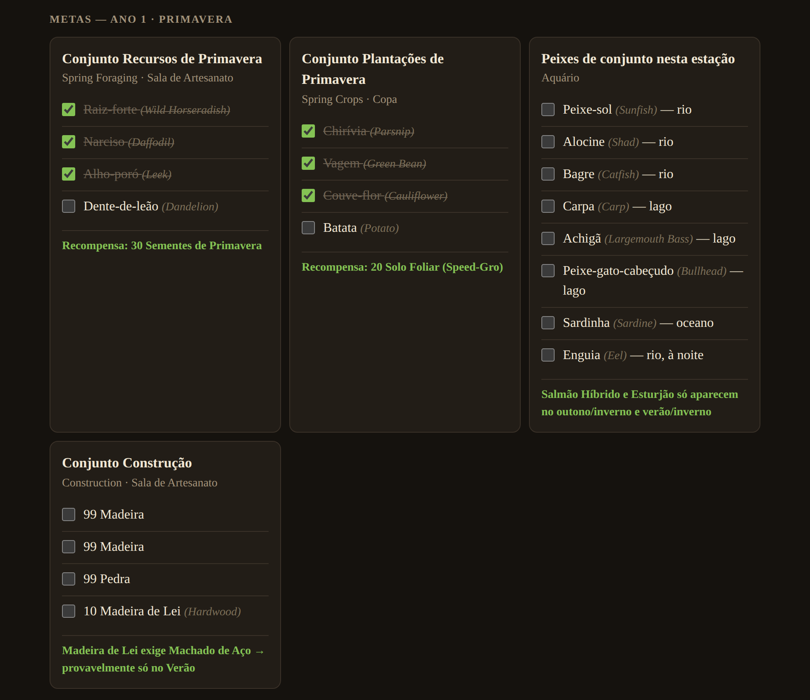
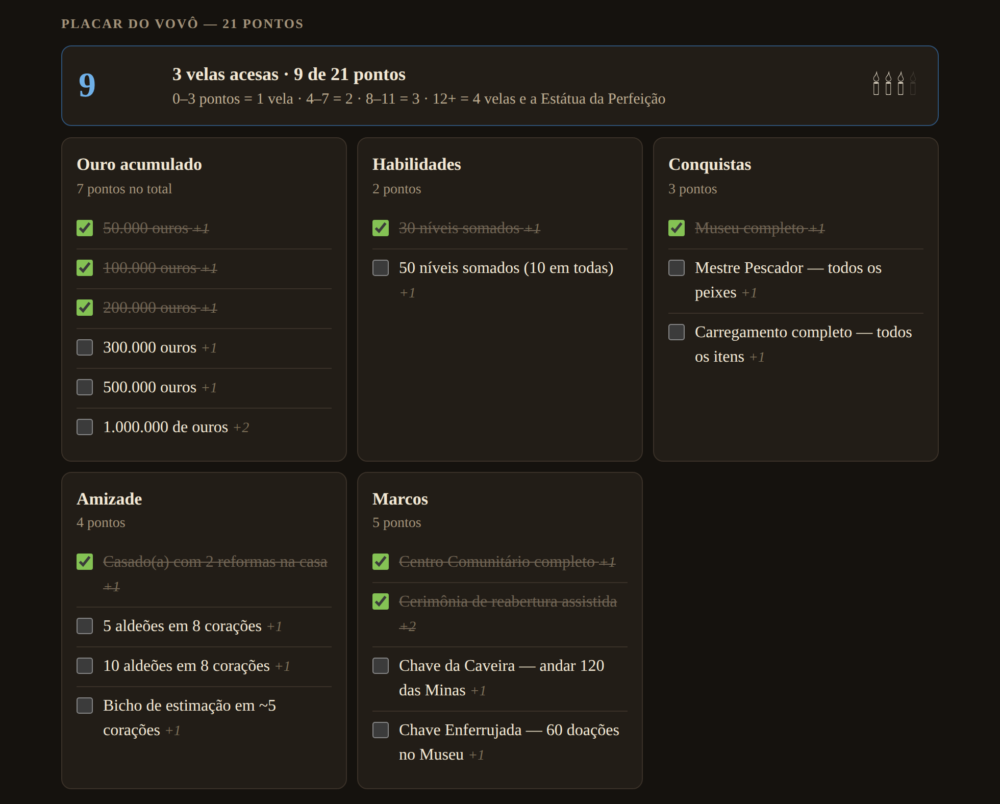
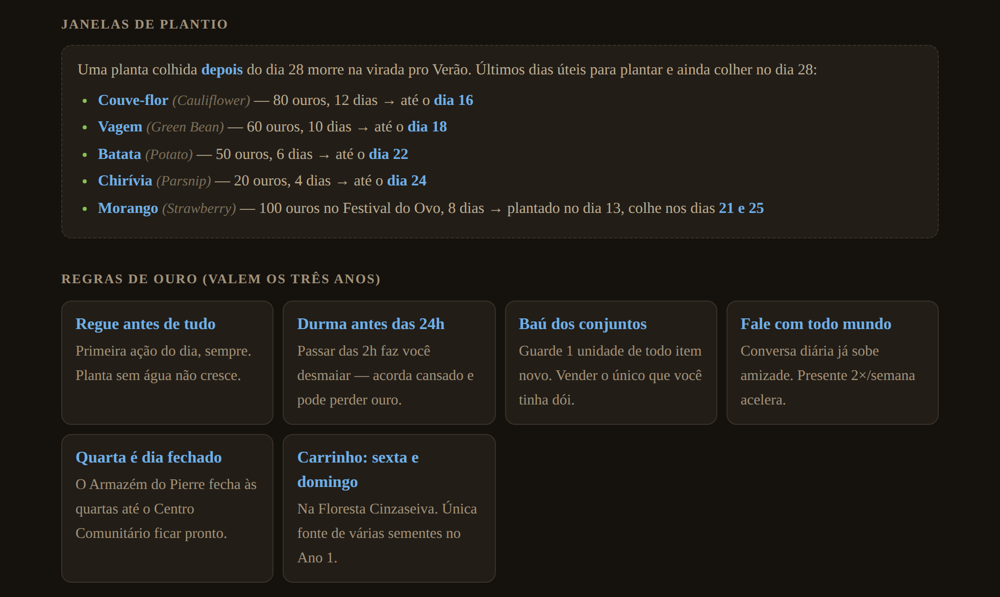
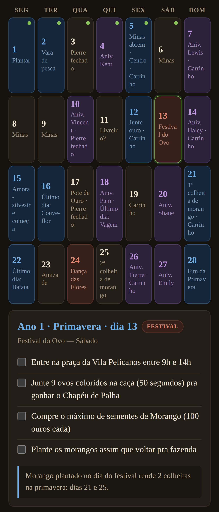

<h1 align="center">🌱 Guia Stardew Valley — Anos 1, 2 e 3</h1>

<p align="center">
  <b>Um guia dia a dia, em português, que cabe num arquivo só e funciona sem internet.</b><br>
  Da primeira chirívia até as 4 velas do vovô.
</p>

<p align="center">
  
  
  
  
  
</p>

<p align="center">
  
</p>

---

## O que é isto

Um guia de Stardew Valley que te diz **o que fazer em cada um dos 336 dias** dos três primeiros anos.

Nada de abrir dez abas da wiki no meio da partida. Você abre o dia, lê as 4 ou 5 tarefas daquele dia, marca o que fez e fecha. O progresso fica salvo sozinho.

**Por que ele existe:** guia de Stardew Valley não falta — mas quase tudo está em inglês, espalhado em várias páginas e depende de internet. Este é grátis, em português, cabe num arquivo só e abre no meio da partida mesmo sem sinal.

## Como usar

### No computador

Baixe o [`index.html`](index.html) e dê dois cliques. Só isso. Qualquer navegador serve.

```bash
git clone https://github.com/Yuumi-32/Guia_Stardew_Valley.git
cd Guia_Stardew_Valley
# abra o index.html no navegador
```

### No celular, offline

1. Abra o [`index.html`](index.html) aqui no GitHub e toque em **Baixar** (o ícone de download, ao lado de *Raw*).
2. Abra o arquivo pelo navegador — no Android, pelo app *Arquivos*; no iPhone, pelo *Arquivos* → *Compartilhar* → abrir no navegador.
3. Pronto. Depois disso não precisa mais de internet: o guia inteiro está naquele arquivo.

> [!TIP]
> Quer um link para abrir de qualquer lugar? Ligue o **GitHub Pages** em *Settings → Pages → Branch: `main` / `root`*. Em um minuto o guia fica no ar em `https://yuumi-32.github.io/Guia_Stardew_Valley/`, e aí dá para usar *Adicionar à tela inicial* no navegador do celular.

### Onde o progresso fica salvo

Nas marcações do próprio navegador (`localStorage`), no aparelho onde você abriu. Isso quer dizer que:

- não precisa de conta, login ou internet;
- o progresso do celular e o do computador são separados;
- limpar os dados do site apaga tudo — o botão **Zerar tudo** faz o mesmo, de propósito.

## O que tem dentro

| | |
|---|---|
| 📅 **336 dias** | Ano 1, 2 e 3 · 4 estações de 28 dias cada |
| ✅ **1.352 itens** para marcar | 1.205 tarefas do dia + 147 itens de conjunto |
| 🎪 **10 festivais por ano** | 36 dias de festival ao todo, com horário, local e o que fazer |
| 🎂 **33 aniversários por ano** | para não perder presente de ninguém |
| 🔑 **51 eventos-chave** | Minas abrindo, Kent voltando, ônibus consertado… |
| 🕯️ **21 pontos do vovô** | o placar da avaliação, com as 4 velas |

### Um dia, por dentro

Clique num dia e ele abre a lista de tarefas — com um bilhete no fim explicando o *porquê* quando a jogada tem pegadinha.


### Metas da estação

Os conjuntos do Centro Comunitário quebrados por estação, com a recompensa de cada um e o nome em inglês do lado — para quem joga com o jogo em inglês.



<details>
<summary><b>Mais telas</b> — placar do vovô, janelas de plantio e o guia no celular</summary>

<br>

**Placar do vovô** (aparece no Ano 3): 21 pontos, 4 velas, e quanto falta para a Estátua da Perfeição.



**Janelas de plantio e regras de ouro**: o último dia útil para plantar cada cultura sem perder a colheita.



**No celular**, que é onde ele foi feito para ser lido:



</details>

## Como ler o calendário

Cada dia tem uma cor, e a bolinha verde no canto aparece quando você marcou tudo daquele dia:

| Cor | Significa |
|---|---|
| 🟥 **Vermelho** | Festival — o dia inteiro muda de rotina |
| 🟪 **Roxo** | Aniversário de aldeão |
| 🟦 **Azul** | Evento-chave: prazo de plantio, Minas abrindo, primeira colheita |
| ⬛ **Sem cor** | Dia de rotina |

E dois botões que mudam o guia inteiro:

- **Ano 1 / 2 / 3** — Ano 1 é roteirizado dia a dia (o objetivo é o Centro Comunitário). A partir do Ano 2 o jogo abre, então os dias sem evento trazem a rotina padrão da estação em vez de tarefa inventada.
- **Simples / Detalhado** — *Detalhado* mostra o nome em inglês em cinza ao lado de cada item (`Chirívia (Parsnip)`). *Simples* esconde tudo isso e deixa só o português.

## Próximos passos

O plano é virar um app de celular de verdade. O HTML foi o começo justamente por já rodar em qualquer lugar.

- [x] Guia completo dos três anos, com progresso salvo
- [x] Modo simples e modo detalhado
- [ ] **Ajustar o calendário em telas estreitas** — na largura de um celular os nomes dos dias quebram no meio da palavra (dá para ver na captura do celular)
- [ ] **Virar PWA** — um `manifest.json` e um service worker já dão ícone na tela inicial e offline de verdade, sem precisar reescrever nada
- [ ] **Empacotar como APK** para publicar na Play Store
- [ ] Exportar e importar o progresso, para levar do celular pro computador
- [ ] Ilha Gengibre e o que vem depois do Ano 3

## Tecnologia

Um arquivo HTML de ~76 KB. Sem framework, sem `npm install`, sem build, sem servidor, sem back-end, sem rastreamento. HTML, CSS e JavaScript puro, tudo junto num arquivo só — é por isso que ele abre offline e vai continuar abrindo daqui a dez anos.

A única coisa que vem de fora é a fonte [Eczar](https://fonts.google.com/specimen/Eczar), do Google Fonts. Sem internet ele cai numa fonte serifada do sistema e continua funcionando normalmente.

## Sobre a precisão

Baseado na **versão 1.6** do jogo. Datas de festivais, aniversários, itens de conjunto, preços, tempos de cultivo e o sistema de 21 pontos do vovô foram conferidos na [Stardew Valley Wiki](https://stardewvalleywiki.com/). Os nomes em português vêm da versão brasileira da wiki.

A **ordem dia a dia é estratégia**, não regra do jogo — dá para jogar de outro jeito e chegar no mesmo lugar. E tem coisa que eu não consegui confirmar 100%: a penalidade exata de ouro ao desmaiar às 2h, se o Bagre exige chuva, e a tradução oficial de alguns nomes de lugar. Está tudo anotado no fim da página do guia.

## Contribuindo

Achou um erro de data, um item faltando num conjunto ou uma tradução errada? [Abra uma issue](https://github.com/Yuumi-32/Guia_Stardew_Valley/issues) — de preferência com o link da wiki que comprova. Correção de conteúdo vale mais que código aqui.

Se for mexer no arquivo: os dados dos três anos ficam nas constantes `ANO1`, `ANO2` e `ANO3` no `<script>` do fim do `index.html`. Anos 2 e 3 usam a função `mkEstacao()`, que preenche com a rotina padrão os dias sem evento.

## Créditos

Stardew Valley é um jogo do [ConcernedApe](https://www.stardewvalley.net/). Este guia é um projeto de fã, sem vínculo com o criador, e não substitui o jogo — só ajuda a não perder o prazo do repolho roxo de novo.
