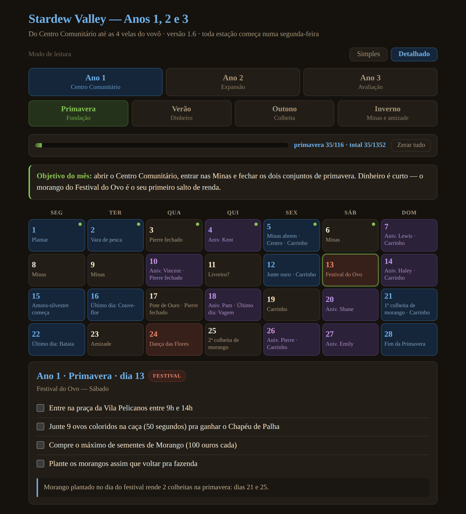
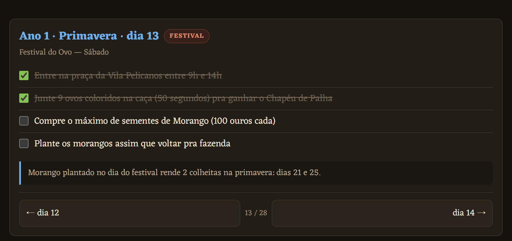
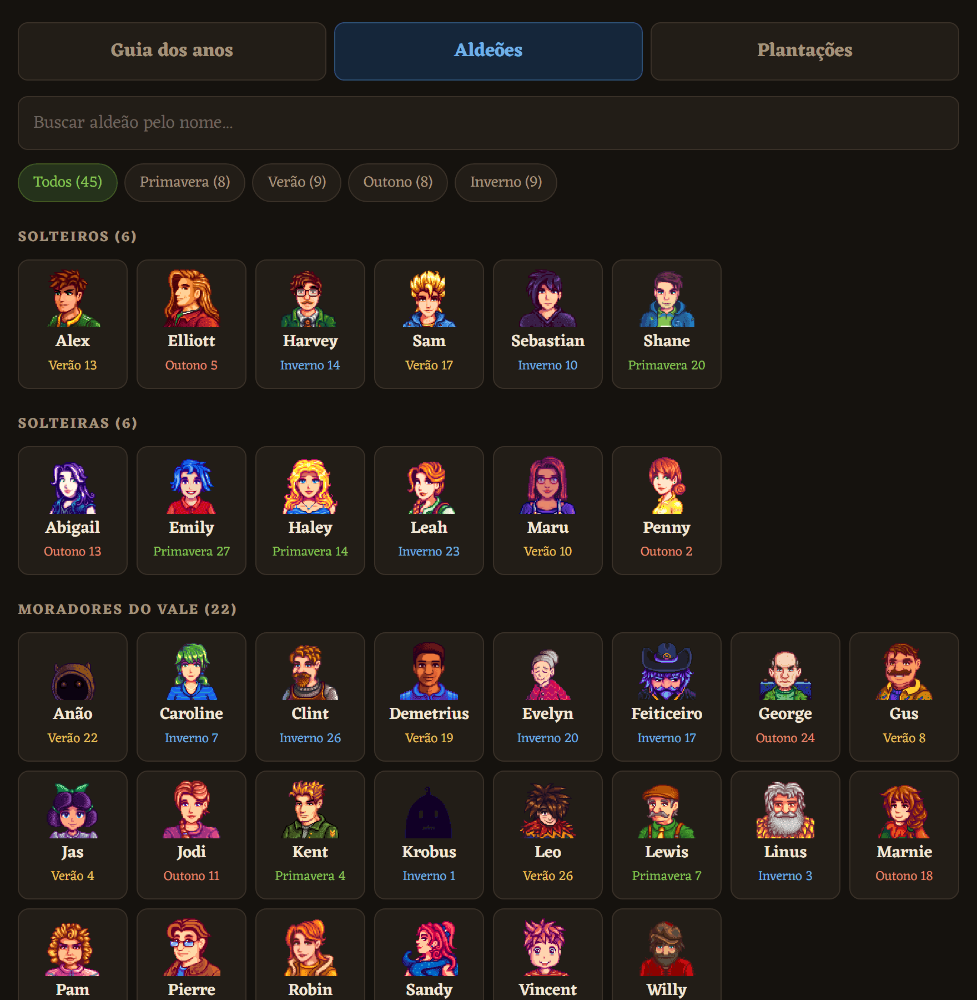
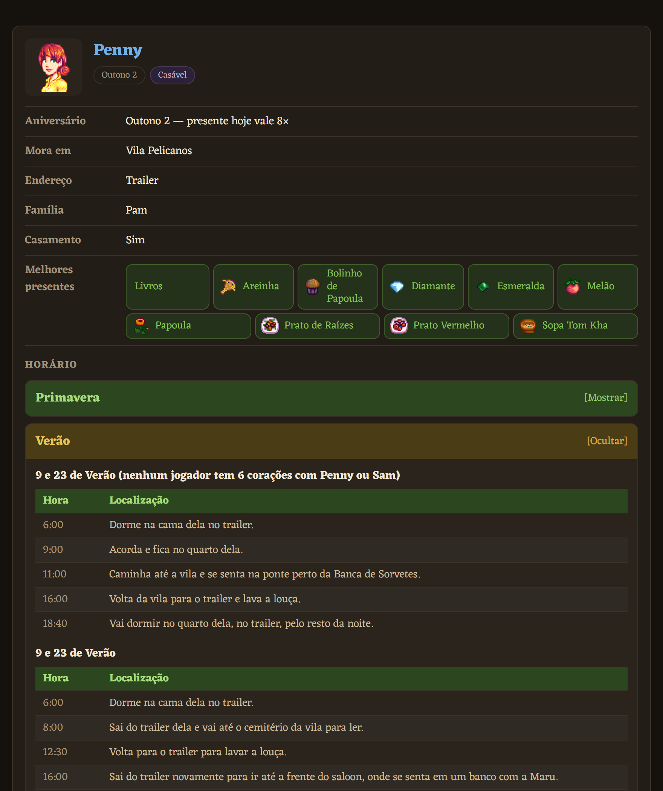
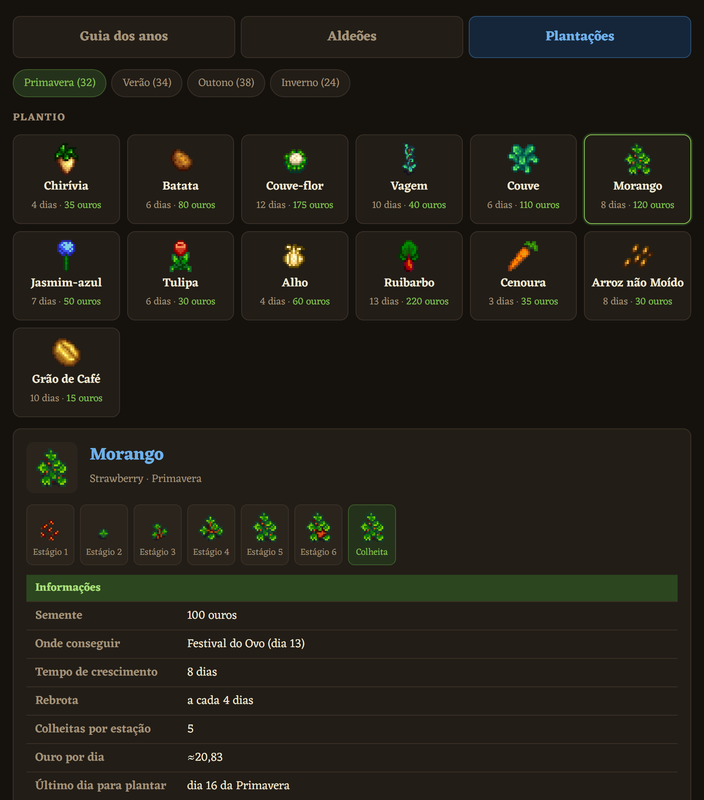
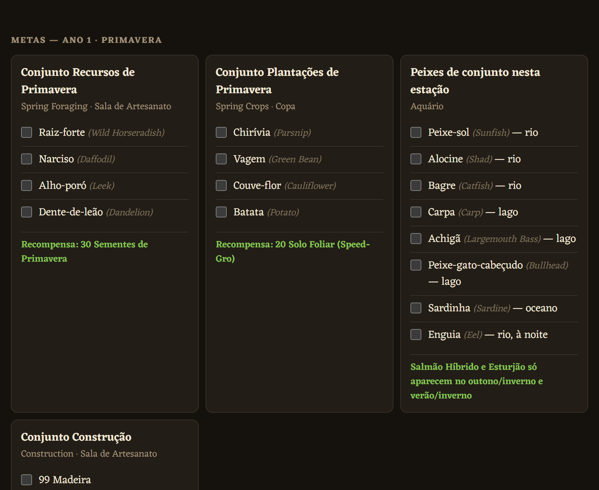
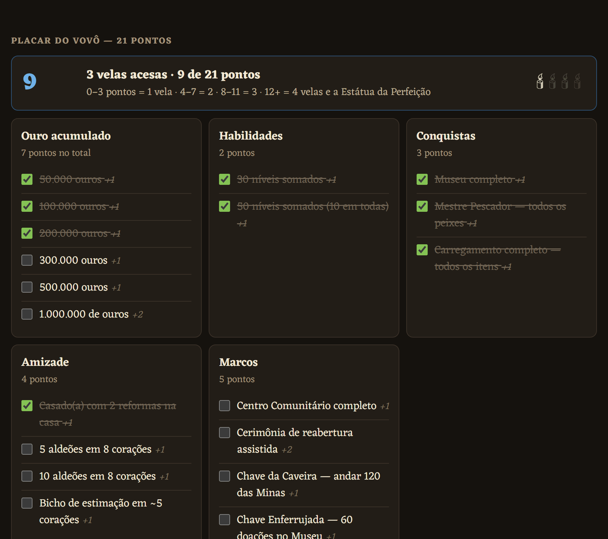
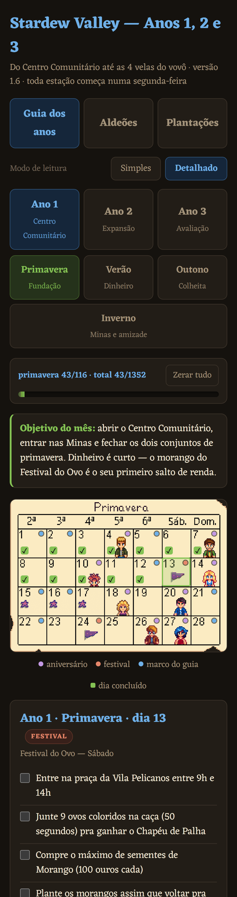

<h1 align="center">🌱 Guia Stardew Valley — Anos 1, 2 e 3</h1>

<p align="center">
  <b>Um guia dia a dia, em português, que cabe num arquivo só e funciona sem internet.</b><br>
  Da primeira chirívia até as 4 velas do vovô.
</p>

<p align="center">
  
  
  
  
  
</p>

<p align="center">
  
</p>

---

## O que é isto

Um guia de Stardew Valley que te diz **o que fazer em cada um dos 336 dias** dos três primeiros anos — e, quando você trava no meio da partida, também te diz **o que dar de presente para a Penny** e **qual é o último dia para plantar Morango**.

Nada de abrir dez abas da wiki no meio do jogo. Você abre o dia, lê as 4 ou 5 tarefas daquele dia, marca o que fez e fecha. O progresso fica salvo sozinho, e quando você voltar o guia abre exatamente onde parou.

**Por que ele existe:** guia de Stardew Valley não falta — mas quase tudo está em inglês, espalhado em várias páginas e depende de internet. Este é grátis, em português, cabe num arquivo só e abre no meio da partida mesmo sem sinal.

## As quatro abas

### 📅 Guia dos anos

O roteiro dia a dia. O calendário é a imagem do calendário do próprio jogo, com os dias clicáveis por cima — as bolinhas coloridas marcam festival, aniversário e marco do guia, e o ✓ verde aparece quando você fecha o dia.

Clique num dia e ele abre a lista de tarefas, com um bilhete no fim explicando o *porquê* quando a jogada tem pegadinha. No fim da ficha, os botões levam para o dia anterior e o próximo — no dia 28 eles viram a estação sozinhos, e do Inverno pulam para o ano seguinte. No computador as setas ← e → do teclado fazem o mesmo.



### 👥 Aldeões

Os **45 moradores do vale**, com o retrato de cada um embutido no arquivo. Busca por nome e filtro pela estação do aniversário.



Clique num aldeão e sai a ficha: aniversário, onde mora, família, se dá para casar, os **melhores presentes** com o ícone de cada item, e o **horário completo** dele — por estação, com os desvios de chuva e festival e a rotina depois do casamento.



### 🌾 Plantações

Plantio, coleta e peixes de cada estação. Cada planta mostra os **estágios de crescimento** um por um, quanto tempo leva, se rebrota, quanto rende por dia, o **último dia útil para plantar** e o preço nas quatro qualidades.

Os **57 peixes** trazem onde pescar, a hora, o clima que exigem, a dificuldade com o tipo de fisgada e o tamanho — inclusive os quatro lendários de estação, com o nível de Pesca que cada um cobra.



### 🏝️ Ilha

A Ilha Gengibre não cabe no calendário: ela abre quando você conserta o barco do Willy, no Verão 15 do Ano 2, e depois disso é um lugar para onde se volta, não um mês para cumprir. Por isso ganhou aba em vez de virar um quarto ano.

Tem o custo do barco e da passagem, as cinco regiões uma a uma, e as **130 nozes douradas** listadas por região — que é a parte que mais faz perder tempo, porque o papagaio do Leo só diz quantas faltam, nunca onde. Junto vão o que cada melhoria custa em noz, a fazenda que planta o ano inteiro, as quatro culturas que só existem lá e os quatro peixes que também.

No fim, **o que vem depois do Ano 3**: as onze categorias da perfeição, com o peso de cada uma, que é a régua que substitui o placar do vovô quando ele fecha.

<details>
<summary><b>Mais telas</b> — metas da estação, placar do vovô e o guia no celular</summary>

<br>

**Metas da estação**: os conjuntos do Centro Comunitário quebrados por estação, com a recompensa de cada um e o nome em inglês do lado — para quem joga com o jogo em inglês.



**Placar do vovô** (aparece no Ano 3): 21 pontos, 4 velas, e quanto falta para a Estátua da Perfeição.



**No celular**, que é onde ele foi feito para ser lido:



</details>

## Como usar

### No computador

Baixe o [`index.html`](index.html) e dê dois cliques. Só isso. Qualquer navegador serve.

```bash
git clone https://github.com/Yuumi-32/Guia_Stardew_Valley.git
```

Depois é só abrir o `index.html` no navegador.

### No celular — instalando como app

Este é o jeito recomendado.

1. Abra **<https://yuumi-32.github.io/Guia_Stardew_Valley/>** no celular.
2. No menu do navegador, toque em **Instalar app** (Android) ou **Adicionar à Tela de Início** (iPhone, pelo botão de compartilhar).
3. Pronto. O guia ganha ícone próprio, abre em tela cheia sem a barra do navegador, e **funciona sem internet** — na primeira visita ele guarda tudo no aparelho.

Depois de instalado ele não depende mais de sinal. Quando você abrir com internet, ele busca a versão nova em segundo plano e ela entra na abertura seguinte, sem nunca fazer você esperar.

### No celular — baixando o arquivo

Se preferir não instalar nada, o guia continua sendo um arquivo só:

1. Abra o [`index.html`](index.html) aqui no GitHub e toque em **Baixar** (o ícone de download, ao lado de *Raw*).
2. Abra o arquivo pelo navegador — no Android, pelo app *Arquivos*; no iPhone, pelo *Arquivos* → *Compartilhar* → abrir no navegador.
3. Pronto. Depois disso não precisa mais de internet: o guia inteiro está naquele arquivo.

Por esse caminho não há service worker (navegador nenhum roda um em `file://`), então não tem ícone nem tela cheia — e é onde o aviso de progresso não guardado costuma aparecer.

### Onde o progresso fica salvo

Nas marcações do próprio navegador (`localStorage`), no aparelho onde você abriu. Junto com elas ficam guardados a aba, o ano, a estação e o dia que estavam abertos, então reabrir o guia te devolve para onde você parou. Isso quer dizer que:

- não precisa de conta, login ou internet;
- o progresso do celular e o do computador são separados;
- limpar os dados do site apaga tudo — o botão **Zerar tudo** faz o mesmo, mas avisa antes quantas marcações vai apagar.

Nada disso sai do aparelho: não há servidor deste guia para onde mandar. A [política de privacidade](https://yuumi-32.github.io/Guia_Stardew_Valley/privacidade.html) diz item por item o que fica guardado e o que não existe.

> [!WARNING]
> Alguns navegadores simplesmente recusam guardar: aba anônima, dados de site bloqueados, ou o arquivo aberto direto por `file://` em alguns celulares. Nesse caso o guia mostra uma faixa no topo assim que abre — **este navegador não está guardando seu progresso**. Ela existe porque antes o guia se comportava igual nos dois casos: você marcava o dia inteiro, o visto verde aparecia, e nada tinha sido gravado. Se a faixa aparecer, use **Salvar cópia do progresso** antes de fechar; o arquivo `.json` funciona mesmo sem `localStorage`.

### Cópia do progresso

Embaixo da barra tem **Salvar cópia do progresso**, que baixa um arquivo `.json`, e **Restaurar de um arquivo**, que traz de volta. É como se leva o progresso do celular para o computador, e é a única forma de ter uma cópia — o resto mora só no aparelho.

Restaurar substitui o que está ali, então o guia diz de quando é a cópia e quantas marcações tem antes de fazer qualquer coisa. Arquivo que não é uma cópia do guia é recusado sem mexer em nada.

Marcação de uma versão bem antiga do guia, cuja tarefa não existe mais, fica de fora — e o guia avisa quantas ficaram.

## O que tem dentro

| | |
|---|---|
| 📅 **336 dias** | Ano 1, 2 e 3 · 4 estações de 28 dias cada |
| ✅ **1.352 itens** para marcar | 1.205 tarefas do dia + 147 itens dos 35 conjuntos |
| 🎪 **12 dias de festival por ano** | com horário, local e o que fazer em cada um |
| 🎂 **33 aniversários por ano** | para não perder presente de ninguém |
| 🔑 **51 marcos** | Minas abrindo, Kent voltando, ônibus consertado… |
| 🕯️ **21 pontos do vovô** | o placar da avaliação, com as 4 velas |
| 👥 **45 aldeões** | 34 com aniversário, presentes e horário · 12 casáveis |
| 🌾 **128 itens de estação** | 45 culturas, 26 coletáveis e 57 peixes, todos com ficha completa |
| 🏝️ **130 nozes douradas** | listadas por região · mais as 4 culturas e os 4 peixes só da ilha |
| 🏆 **11 categorias de perfeição** | a régua que continua depois que o placar do vovô fecha |
| 🖼️ **555 imagens embutidas** | retratos, ícones de presente, estágios de cultivo e os 4 calendários |

## Como ler o calendário

O calendário é a imagem do mês do próprio jogo. Cada dia tem uma bolinha no canto quando acontece alguma coisa, e o ✓ verde aparece quando você marcou tudo daquele dia:

| Bolinha | Significa |
|---|---|
| 🟣 **Roxa** | Aniversário de aldeão |
| 🟠 **Laranja** | Festival — o dia inteiro muda de rotina |
| 🔵 **Azul** | Marco do guia: prazo de plantio, Minas abrindo, primeira colheita |
| 🟢 **✓ verde** | Dia concluído |

E dois botões que mudam o guia inteiro:

- **Ano 1 / 2 / 3** — Ano 1 é roteirizado dia a dia (o objetivo é o Centro Comunitário). A partir do Ano 2 o jogo abre, então os dias sem evento trazem a rotina padrão da estação em vez de tarefa inventada.
- **Simples / Detalhado** — *Detalhado* mostra o nome em inglês em cinza ao lado de cada item (`Chirívia (Parsnip)`). *Simples* esconde tudo isso e deixa só o português.

## Próximos passos

O plano é virar um app de celular de verdade. O HTML foi o começo justamente por já rodar em qualquer lugar.

- [x] Guia completo dos três anos, com progresso salvo
- [x] Modo simples e modo detalhado
- [x] Calendário legível em tela estreita — resolvido trocando a grade desenhada pela imagem do calendário do jogo
- [x] Aldeões: retratos, presentes, família e horários
- [x] Plantações: culturas, coleta e peixes de cada estação
- [x] Navegar de um dia para o outro sem voltar ao calendário
- [x] Conferir os 24 peixes que estavam incompletos — os 57 têm hora, clima, preço, dificuldade e tamanho
- [x] Exportar e importar o progresso, para levar do celular pro computador
- [x] **Virar PWA** — instala na tela inicial com ícone próprio, abre em tela cheia e funciona sem rede, pelo service worker
- [x] **Empacotar como APK** — o build sai do PWA por TWA, com o `twa-manifest.json` versionado e o workflow `APK`
- [ ] Publicar na Play Store — falta a chave de release e o `assetlinks.json` num domínio próprio ([roteiro](docs/publicar.md))
- [x] **Ilha Gengibre e o que vem depois do Ano 3** — aba própria, com as cinco regiões, as 130 nozes listadas por região, o que cada uma compra, a fazenda que planta o ano inteiro e as onze categorias da perfeição
- [ ] Imagens das culturas e dos peixes da ilha — as fichas de lá são as únicas do guia sem sprite, porque essas imagens ainda não foram extraídas

## O APK

O app Android não é um segundo projeto: é o próprio PWA embrulhado numa [TWA](https://developer.chrome.com/docs/android/trusted-web-activity), que abre o site em tela cheia usando o motor do Chrome. Corrigir o guia corrige o app, sem recompilar nada.

O `twa-manifest.json` guarda a configuração do build. Para gerar localmente:

```bash
npx @bubblewrap/cli@1.25.0 update --skipVersionUpgrade && npx @bubblewrap/cli@1.25.0 build
```

Precisa de JDK 17+ e do Android SDK. No CI, o workflow **APK** faz o mesmo — rode pelo botão *Run workflow*, ou publique uma tag `v*` para o APK e o AAB saírem anexados à Release. Ele ainda não rodou nenhuma vez: sem os secrets da chave ele não tem com o que assinar, e por isso a esteira do CI continua não verificada.

> [!NOTE]
> Construindo na sua máquina com o SDK do Android Studio, o Bubblewrap para com *"The provided androidSdk isn't correct"*. Não é o SDK que está errado: ele exige uma pasta `tools` ou `bin` na raiz do SDK, que o layout do Android Studio não tem. Dá para contornar apontando o `androidSdkPath` do `~/.bubblewrap/config.json` para uma pasta espelho — um diretório com um `bin` vazio e junções para o `build-tools`, `platforms` e `platform-tools` do SDK de verdade. No CI o problema não existe, porque a action instala o SDK no layout que ele espera.
>
> Outro detalhe: o campo da versão no `twa-manifest.json` chama-se **`appVersion`**, e não `appVersionName` como o Bubblewrap escreve ao gerar o arquivo. Com o nome errado o APK sai com `versionName` vazio, sem nenhum aviso.

### O que falta para publicar

**A chave de release.** Ela decide a identidade do app na Play Store para sempre, e perdê-la significa nunca mais atualizar o app. Tem que ser sua, criada por você e guardada fora daqui — o `.gitignore` já barra `*.keystore`. Enquanto os três secrets não existirem, o workflow não tem com o que assinar.

**O `assetlinks.json`.** É o arquivo que prova que o app e o site são da mesma pessoa; sem ele o app abre com a barra de endereço do navegador aparecendo em cima, em vez de tela cheia. O detalhe é que ele precisa ficar na **raiz do domínio**, em `https://yuumi-32.github.io/.well-known/assetlinks.json`, e não dentro deste repositório — subcaminho não vale. Para servi-lo é preciso um repositório chamado `Yuumi-32.github.io`, ou um domínio próprio.

**A conta na loja.** Taxa única de US$ 25, verificação de identidade e a ficha para preencher — ícone, capturas, descrição e uma política de privacidade com URL pública.

Os três estão destrinchados em [`docs/publicar.md`](docs/publicar.md), na ordem, com o comando de cada etapa e o jeito de conferir que ela deu certo antes de seguir para a próxima.

> [!WARNING]
> O guia usa arte do jogo. Publicar app de fã com material de terceiros numa loja é um risco diferente de manter uma página no GitHub — a Play Store atende pedido de remoção por marca. Vale decidir isso de olhos abertos; veja o [`NOTICE.md`](NOTICE.md).

## Tecnologia

Um arquivo HTML de ~764 KB. Sem framework, sem `npm install`, sem build, sem servidor, sem back-end, sem rastreamento. HTML, CSS e JavaScript puro, tudo junto num arquivo só — é por isso que ele abre offline e vai continuar abrindo daqui a dez anos.

Ao lado dele moram o `manifest.webmanifest`, o `sw.js` e os ícones, que são o que transforma o guia em app instalável. Eles são um acréscimo, não uma dependência: o `index.html` sozinho continua funcionando exatamente como antes, e é isso que você baixa quando prefere o arquivo avulso.

O arquivo cresceu de 76 KB para 764 KB porque as 555 imagens e a fonte estão **dentro dele**, em base64. Foi de propósito: um guia que precisa baixar retrato da wiki não serve para ler no meio da partida sem sinal.

**Nada vem de fora.** A fonte [Eczar](https://fonts.google.com/specimen/Eczar) também está embutida — o subset latin do arquivo variável, que cobre os pesos 400 a 800 em 26 KB. Abrir o guia não dispara nenhuma requisição de rede, então ele tem a mesma cara com ou sem sinal.

Seta, `✓` e `≈` ficam fora do subset latin e usam a fonte do sistema, como já acontecia quando a Eczar vinha do Google.

## Sobre a precisão

Baseado na **versão 1.6** do jogo. Datas de festivais, aniversários, itens de conjunto, preços, tempos de cultivo, horários dos aldeões e o sistema de 21 pontos do vovô foram conferidos na [Stardew Valley Wiki](https://stardewvalleywiki.com/). Os nomes em português vêm da versão brasileira da wiki.

A **ordem dia a dia é estratégia**, não regra do jogo — dá para jogar de outro jeito e chegar no mesmo lugar.

Os **57 peixes** estão completos: hora, clima, preço, dificuldade e tamanho de cada um saem da tabela da wiki. O tamanho aparece em centímetros; a wiki dá em polegadas.

O que continua em aberto: a penalidade exata de ouro ao desmaiar às 2h, se o Bagre exige chuva e a tradução oficial de alguns nomes de lugar. Está anotado no fim da página do guia.

## Contribuindo

Achou um erro de data, um item faltando num conjunto ou uma tradução errada? [Abra uma issue](https://github.com/Yuumi-32/Guia_Stardew_Valley/issues) — de preferência com o link da wiki que comprova. Correção de conteúdo vale mais que código aqui.

Se for mexer no arquivo, tudo está no `<script>` do fim do `index.html`:

| Constante | O que guarda |
|---|---|
| `ANO1`, `ANO2`, `ANO3` | o roteiro dia a dia e os conjuntos de cada estação |
| `PLACAR` | os 19 itens e 21 pontos da avaliação do vovô |
| `NPCS`, `HORARIOS` | os 45 aldeões e os horários de 34 deles |
| `CULTIVOS`, `COLETA`, `PEIXES` | o que dá para plantar, colher e pescar em cada estação |
| `RETRATOS`, `PRESENTES`, `CIMG`, `CALENDARIOS` | as imagens em base64 |

Anos 2 e 3 usam a função `mkEstacao()`, que preenche com a rotina padrão os dias sem evento.

A aba **Ilha** é a exceção: o conteúdo dela é HTML escrito à mão, dentro de `<div id="viewIlha">`, e não sai de constante nenhuma. Ela também não entra na barra de progresso — como Aldeões e Plantações, é material de consulta, não lista de marcar.

### Refazendo as capturas de `capturas/`

Elas alimentam a tela de instalação do Android, e o Chrome é exigente com o formato — mexer nelas no olho quebra o cartão de instalação sem avisar. As regras:

- cada lado entre 320 e 3840 pixels;
- o lado maior no máximo **2,3 vezes** o menor;
- **mesma proporção** dentro de cada grupo, e pelo menos uma `wide` e uma `narrow`.

O que está lá hoje: celular a **1170×2532** (viewport de 390×844 a 3×) e tela larga a **1920×1080** (1280×720 a 1,5×).

> [!WARNING]
> Não dá para capturar o layout de celular com `chrome --headless --screenshot --window-size`: o Chrome headless força uma viewport mínima de **500px**, então sai o layout de desktop cortado. É preciso emular o dispositivo de verdade, pelo `Emulation.setDeviceMetricsOverride` do DevTools Protocol, ou pelo painel de dispositivos do navegador.

Depois de capturar, salve em paleta indexada de 256 cores: a interface é de cores chapadas e isso corta uns 60% do peso sem diferença visível. Se mudar o tamanho, atualize também o `sizes` de cada uma no `manifest.webmanifest` — ele precisa bater com o arquivo.

> [!IMPORTANT]
> A chave de cada marcação sai do **texto do item**, não da posição dele na lista. Na prática: acrescentar, tirar ou reordenar tarefas é de graça — ninguém perde o que já tinha marcado. Mas **reescrever o texto de uma tarefa apaga a marcação dela** em quem já usa o guia, porque vira outro item. Para corrigir só um erro de digitação, vale pesar se compensa.

## Licença

O código, o texto do roteiro e a documentação estão sob [MIT](LICENSE) — pode forkar, adaptar e redistribuir à vontade.

As 555 imagens embutidas no `index.html` e as capturas em `docs/imagens/` vêm do jogo e continuam sendo da ConcernedApe. Elas **não** estão cobertas pela MIT. O [`NOTICE.md`](NOTICE.md) diz exatamente o que é de quem.

## Créditos

Stardew Valley é um jogo do [ConcernedApe](https://www.stardewvalley.net/). Este guia é um projeto de fã, sem vínculo com o criador, e não substitui o jogo — só ajuda a não perder o prazo do repolho roxo de novo.
